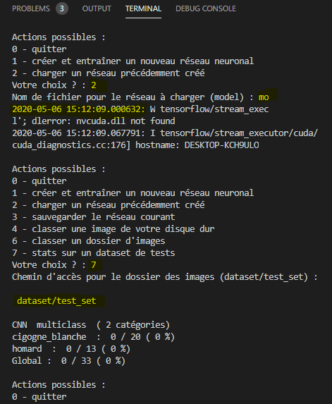
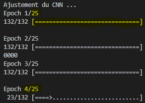
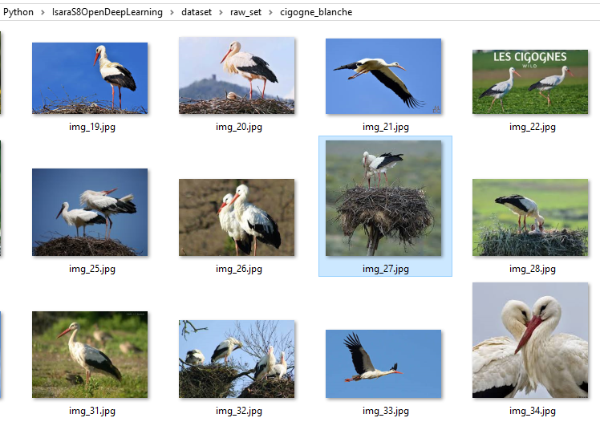
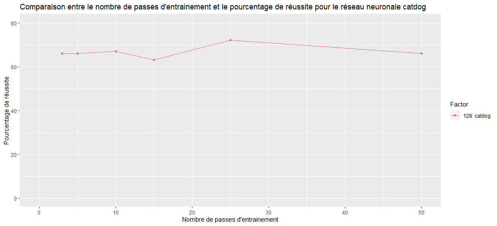
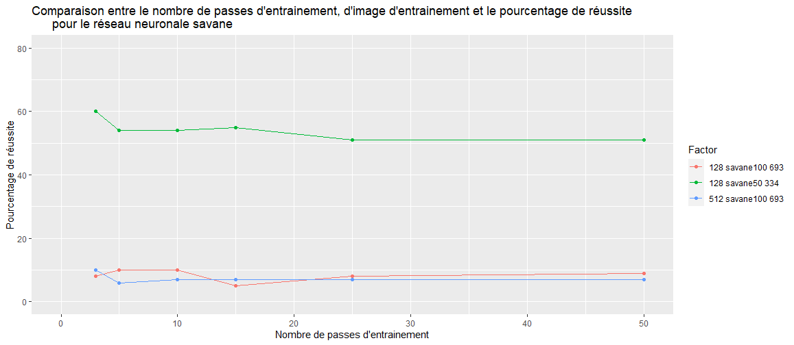

# **Nos essais**

Pour la reconnaissance d'images, nous avons choisi le domaine très vaste des animaux. Ainsi, les images téléchargées sont à classer en 2 catégories d'animaux très différents, mais que nous avons choisit :

* Les cigognes blanches
* Les homards

**Quelques remarques sur la constitution du corpus d'apprentissage :** 

Le dossier raw_set contient 2 dossiers (1 par catégorie).

Lors du téléchargement des images de homards, certaines présentaient des plats de homards cuisinés. Nous avons décidé de ne garder que les images de homards entiers, vivants (bleus) ou cuits (rouges). Ainsi, sur 100 images téléchargées, 65 ont été conservées.

Concernant les cigognes, les 100 images ont été conservées.

## La création du réseau neuronal
Avant la création du réseau neuronal, on commence par entrer : `models/catdog_5p`dans le terminal de commande Visua Studio Code. Il s'agit de faire appel au réseau neuronal qui identifie les chiens et les chats en 5 passes. Évidemment, comme ce dernier identifie les chiens et les chats, on va obtenir des résultats de 0% après l'avoir utilisé pour identifier des cigognes et des homards. Donc on utilise juste ce modèle pour tester si ça fonctionne : 

```{r catdogmodel, echo=FALSE, out.width = '80%', fig.align = "center",fig.cap="Les catégories cigogne_blanche et homard ont été identifiées, avec des résultats de 0% du fait du modèle choisi."}

```

Maintenant, la phase d'aprentissage peut commencer. Parmis les actions possibles : 

* Votre choix ? `1` (créer et entraîner un nouveau réseau neuronal)
* Chemin d'accès du dataset (dataset) : `dataset`
* Nombre de passes d'apprentissage (25) : `25`
* Tenter une classification binaire ? o/n (o) : `o`

On décide de lancer 25 passes d'apprentissage : 
```{r 4sur25p, echo=FALSE, out.width = '45%', fig.align = "center",fig.cap="Lancement de la 4e passe d'apprentissage sur les 25"}

```

Puis on enregistre le réseau neuronal :

* Votre choix ? : `3`(sauvegarder le réseau courant)
* Nom de fichier pour le réseau à enregistrer (model) : `cigogne_et_homard_25p`

son utilisation et sa performance

Nos 3 fichiers de sauvegarde du réseau neuronal sont les suivants :

* cigogne_et_homard_25p.categories
* cigogne_et_homard_25p.h5
* cigogne_et_homard_25p.json

## Résultats

Après 25 passes d'apprentissage, on peut observer les résultats avec l'action n°6 :

* Votre choix ? : `6` (classer un dossier d'images)
* Chemin d'accès pour le dossier des images (dataset/test_set) : `dataset/test_set`

Les statistiques sur le dataset de tests donnent de très bons résultats :

* CNN binary (2 catégories)
* cigogne_blanche : 19/20 (95%)
* homard : 13/13 (100%)
* Global : 32/33 (96%)

En effet, le programme a reconnu toutes les images de homard, et seule la photo de cigogne n°27 a été prise pour une photo de homard par le programme : `dataset/test_set\cigogne_blanche\img_27.jpg homard`. L'image qui n'a pas été reconnue est la suivante : 

```{r cigogne_non_reconnue, echo=FALSE, out.width = '80%', fig.align = "center",fig.cap="L'image img_27.jpg (sélectionnée en bleu) a été reconnue comme étant une image de homard par le programme"}

```

# **Études de réseaux précédemment créés**

Nous avons réalisé un graphique à partir des données models.csv avec en abscisses le nombre de passes d'entraînement et en ordonnée le pourcentage de réussite, pour les catégories catdog et savane.Le but est de déterminer si le nombre de passes d'entraînement permet réellement d'augmenter le pourcentage de réussite de reconnaissance d'images.

```{r CATDOG(2), echo=FALSE, out.width = '80%', fig.align = "center",fig.cap="Evolution du pourcentage de réussite en fonction du nombre de passes d'entraînement pour la catégrorie d'images 'catdog'"}

```
```{r SAVANE(2), echo=FALSE, out.width = '80%', fig.align = "center",fig.cap="Evolution du pourcentage de réussite en fonction du nombre de passes d'entraînement pour la catégrorie d'images 'savane'"}

```


Nous pouvons ici constater que pour la catégorie d'image "catdog", le nombre d epasses entraînant la meilleure efficacité est de 25, puis diminue progressivement. Augmenter le nombre de passes n'augmente pas nécessairement le pourcentage de réussite.
Pour la catégorie "savane", il semble encore plus évident que l'efficacité diminue avec le nombre de passes. 

# **Nos remarques sur cette séquence et ce qu'elle nous a apporté**
Cette séquence nous a permis de découvrir et de mettre en pratique la notion de machine (deep plutôt?) learning. Le fait de savoir comment fonctionne un corpus d'apprentissage permet, entre autres, d'utiliser les applications mobiles de reconnaissance d'images en comprennant comment ces dernières fonctionnent et non plus comme des consommateur·trice·s "naïfs·naïves".
D'autant plus que cette notion est parfaitement d'actualité, avec l'arrivée de la reconnaissance faciale dans notre quotidien (voir le documentaire d'Arte "Tous surveillés : sept milliards de suspects" diffusé le 21/04/2020).
Nous avons pu aussi mettre un pied dans le monde de la programmation et du code, que nous ne connaissions que très peu auparavant, et cela s'est avéré très interessant.
